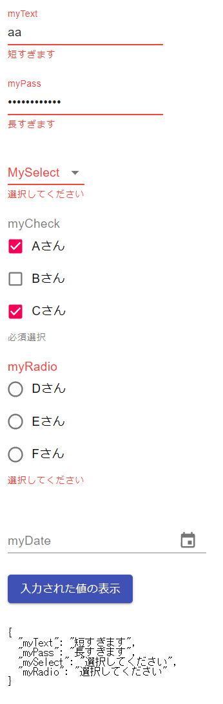
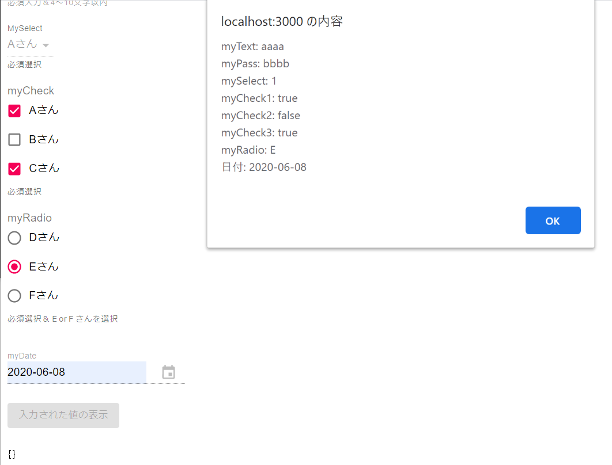

# sample-formik-03-formik-material-ui
formikのサンプル（formik-material-ui利用）

## インストール

```
> yarn add formik
> yarn add yup
> yarn add formik-material-ui
> yarn add @material-ui/core

以下は datepicker を利用するために必要
> yarn add formik-material-ui-pickers
> yarn add @date-io/date-fns@1.x
> yarn add date-fns
> yarn add @material-ui/pickers
> yarn add @material-ui/icons
```

## GitHub

■Formik  
https://github.com/jaredpalmer/formik

■yup（Formik公式推奨のバリデーション実装ライブラリ）  
https://github.com/jquense/yup

■formik-material-ui
https://github.com/stackworx/formik-material-ui

## WebSite

■Formik  
https://jaredpalmer.com/formik/

■Formik Material-UI
https://stackworx.github.io/formik-material-ui/

## 画面イメージ

  


## 課題

- DateTime系のチェックが正常に動かなかったので要検証
